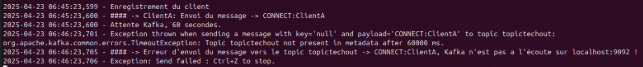
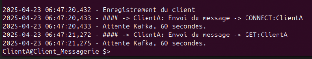
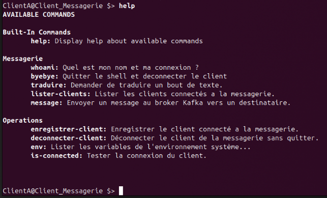
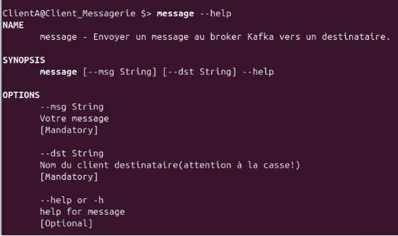
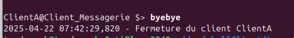
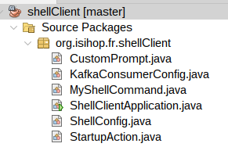
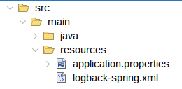


**CLI SHELL MESSAGERIE**


**Qu’est ce que c’est ?**

Le Shell « Messagerie » est un outil basé sur un développement en « SpringBoot Shell » qui permet au travers d’un code source simple de proposer une interface CLI de messagerie basé sur Apache Kafka en mode texte idéale pour appréhender un bus à messages comme Kafka.

Code source à cet emplacement :

<https://github.com/univphf/shellclient.git>

Cette application messagerie permet de se connecter au bus M-O-M Apache Kafka au travers de 4 topics ;

- **topicin** => réception des messages des clients
- **topicout** => envoi de messages vers les clients
- **topictechin** => réception des messages techniques provenant du service cons-db-srv
- **topictechout** => envoi de commande (messages techniques) vers cons-db-srv.

Ces topics doivent être en auto-création au niveau de votre broker Kafka (voir <https://kafka.apache.org/documentation/#configuration> *auto.create.topics.enabled*)

**Démarrage du client Shell**

$> java -jar shellClient-0.0.1.jar => permet de lancer le client avec ses paramètres par défaut.

Les paramètres par défaut sont :

```
#options du shell
#pas de scripting possible
spring.shell.script.enabled=false

#mode interactif
spring.shell.interactive.enabled=true

#option de connexions du producer kafka
spring.kafka.producer.bootstrap-servers=localhost:9092
spring.kafka.producer.key-serializer=org.apache.kafka.common.serialization.StringSerializer
spring.kafka.producer.value-serializer=org.apache.kafka.common.serialization.StringSerializer


#definition du nom des topics pour ces services
application.topicin=topicin
application.topicout=topicout
application.topictechout=topictechout
application.topictechin=topictechin
#nom du client, a modifier pour chaque client

**application.monnom=ClientA**

#options du consommateur kafka
#le group id fait office de nom d'application...
######################################
spring.kafka.consumer.group-id=Client\_Messagerie
######################################
spring.kafla.consumer.enable.auto.commit=true
spring.kafka.consumer.auto-offset-reset=latest
spring.kafka.consumer.key-deserializer=org.apache.kafka.common.serialization.StringDeserializer
spring.kafka.consumer.value-deserializer=org.apache.kafka.common.serialization.StringDeserializer

#options des logs
logging.level.org.apache.kafka=OFF

log4j.rootLogger=DEBUG, stdout
log4j.appender.stdout=org.apache.log4j.ConsoleAppender
log4j.appender.stdout.layout=org.apache.log4j.PatternLayout
log4j.appender.stdout.layout.ConversionPattern=%d{ISO8601} %-5p [%t] %c: %m%n
```

Vous pouvez exécuter ce client avec des paramètres différents en les passant au travers de variables d’environnement. Il faut pour cela reprendre un ou plusieurs paramètres de ce fichier, remplacer les caractères spéciaux par « \_ », vous pouvez également si nécessaire ajouter d’autres paramètres permettant d’ajuster Kafka consumer ou producer ou SpringBoot etc...

Passage de paramètres par variable d’environnement :

Exemple pour modifier uniquement le paramètre « application.monnom »  :

**//remplacer le . Par \_ & - par \_**

$> export spring\_kafka\_consumer\_group\_id=Ma\_Messagerie

$> export application\_monnom=ClientB

$> java -jar shellClient-0.0.1.jar

Lors de cette exécution seul les paramètres « application.monnom » et « spring.kafka.consume.group-id » sont modifié, les autres paramètres gardent leurs valeurs par défaut.

**A noter que le paramètre « application.monnom » doit impérativement être différent pour chaque client afin de correctement les distinguer.**

D’autres techniques par passage de paramètre direct sur la CLI d’exécution est possible également ou via le passage en paramètre d’un fichier de configuration de type properties, mais ne fonctionneront pas ici dans ce contexte du Shell.

Voir: <https://docs.spring.io/spring-boot/docs/2.1.x/reference/html/boot-features-external-config.html>

**Comment fonctionne la CLI**

La CLI cherche a se connecter a Kafka dans un premier temps et envoyer les messages techniques suivants vers le service cons-db-srv.

CONNECT:ClientA  => signaler que ClientA veux se connecter.

GET:ClientA  => lister tous les clients connectés disponibles et retourner cette liste à ClientA.



Si kafka est à l’écoute, le service cons-db-srv répond, sinon le client s’arrête car il ne peut pas communiquer et répond avec les messages d’erreurs explicites ci dessus.

Sinon, si tout se passe bien vous obtenez le prompt de la console comme ci dessous, qui vous indique que le ClientA est connecté et prêt à discuter.



**Les commandes disponibles ?**

Une fois connecté, vous obtenez le prompt de la CLI pour connaître les commandes disponible il faut tapez la commande « **help** ».

Les commandes se retrouvent dans deux groupes, « Operations » et « Messagerie », les commandes dans le groupe « Opérations » sont juste là pour vous aider au debug ou en complément pour la compréhension, les commandes du groupe « Messagerie » sont celle qui seront utile pour le projet et opérerons sur la messagerie.

Ce qui donne la liste suivante de commandes.



Certaines commandes attendent des paramètres, c’est le cas de « **traduire** », « **message** », « **is-connected** ».

Pour connaître les paramètres d’une commande il suffit de taper le nom de la commande suivi de « - - help »

**exemple** :



**Le format des messages envoyés sont** :

Pour la messagerie inter-clients

**FROM:NomCliSrc#TO:NomCliDst#message**

Exemple : FROM:ClientA#TO:ClientB#"bonjour le monde"

La réception de message à le même format, et permet a notre CLI de savoir si le message la concerne et qui est l’expéditeur du message.

Pour les message techniques

**ACTION:NomCliSrc**

Exemple : GET:ClientA  => Le ClientA demande la liste de tous les clients connecté.

Dans le cas particulier de is-connect

ACTION:NomCliSrc#NomClidst

Exemple : ISCONNECTED:ClientA#ClientB => le clientA interroge le service pour savoir si le ClientB est connecté.

Il est impératif de quitter le client via la commande « **byebye** » ceci libère proprement la connexion et signale que ClientX est bien déconnecté.



Envoi du message technique :

DISCONNECT:ClientA


Puis je modifier ce client ?

Oui, le code source est libre et vous pouvez le modifier a votre convenance pour l’adapter à votre projet de TP, les dépendances sont basé sur Maven, consultez le fichier pom.xml avant toute choses.



La structure du package est celle ci dessus.

Le fichier ShellClientApplication.java est le point d’entrée standard du programme.

Il fait appel aux composant StartupAction.java qui se base sur la classe SmartLifeCycle de SprinBoot FrameWork pour capturer le cycle de start & stop du programme.

Le composant CustomPrompt.java permet d’ajuster la ligne du prompt de votre CLI.

Le fichier de configuration ShellConfig.java permet d’éteindre les commande par défaut offerte par la classe Shell de SpringBoot et ne permet que d’utiliser nos propre commandes.

Le fichier KafkaConsumerConfig.java est un fichier de configuration pour Kafka et permet de créer ici le grouip dynamique nécessaire pour distinguer chaque client au niveau des topics de lecture de votre broker Kafka.

Enfin la classe MyShellCommand, qui est le controller principal, implémente l’ensemble des commandes de la CLI basé sur Kafka SpringBoot et Slf4J pour l’affichage console et les traces logs.

Vous remarquerez la présence dans le dossier src/resources des fichiers application.properties pour la gestion des paramètres de l’applications (Kafka clients, shell , logs, appli) et de la présence du fichier logback-spring.xml permettant d’ajuster la réponse « logback » a notre modèle d’affichage et de trace logs dans des fichiers.


